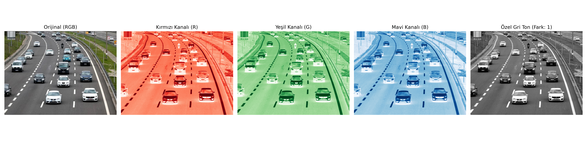
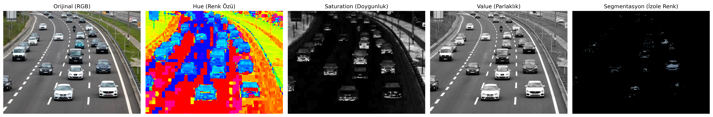

# Module 01: Digital Image Foundations & Color Spaces

## Objective
To understand digital images at the pixel and matrix level, implement mathematical grayscale conversion from scratch, and analyze the advantages of the HSV color space for invariant color tracking.

## Theoretical Background

### 1. Luminance Equation (Grayscale Conversion)
Standard digital color images are composed of three color channels: Red, Green, and Blue (RGB). The human visual system has non-uniform sensitivity to different wavelengths (highest for green, lowest for blue). Converting an RGB image to grayscale requires a weighted sum based on the ITU-R BT.601 standard:

$$Y = 0.299 \cdot R + 0.587 \cdot G + 0.114 \cdot B$$

In `matrix_manipulation.py`, this transformation was implemented using raw NumPy array operations and compared against OpenCV's built-in `cv2.cvtColor()` implementation.

### 2. HSV Color Representation
The RGB color space is illumination-dependent: variations in light intensity alter all three coordinates simultaneously. The cylindrical HSV representation separates chromaticity from luminance:
* **Hue ($H \in [0, 179]$):** Represents the dominant wavelength (color type).
* **Saturation ($S \in [0, 255]$):** Represents color purity.
* **Value ($V \in [0, 255]$):** Represents brightness/intensity.

This decoupling allows color thresholding to remain robust against shadows and ambient lighting changes.

## Implementation Details
* `src/matrix_manipulation.py`: Tensor slicing, linear channel combinations, and residual difference calculation ($\vert{}Y_{\text{custom}} - Y_{\text{cv}}\vert{}$).
* `src/color_spaces.py`: HSV channel decomposition, range thresholding (`inRange`), and bitwise binary masking (`bitwise_and`).

## Results

### Channel Decomposition & Custom Grayscale

*Residual difference between raw matrix implementation and OpenCV kernel was verified to be $\le 1$ LSB due to integer rounding.*

### HSV Decomposition & Target Isolation

*Demonstration of target segmentation using HSV thresholds independent of luminance fluctuations.*

## Practical Application (TEKNOFEST / UAV Pipeline)
The thresholding and bitwise segmentation implemented in this module serve as the baseline pre-processing pipeline for autonomous landing target detection and optical marker tracking.